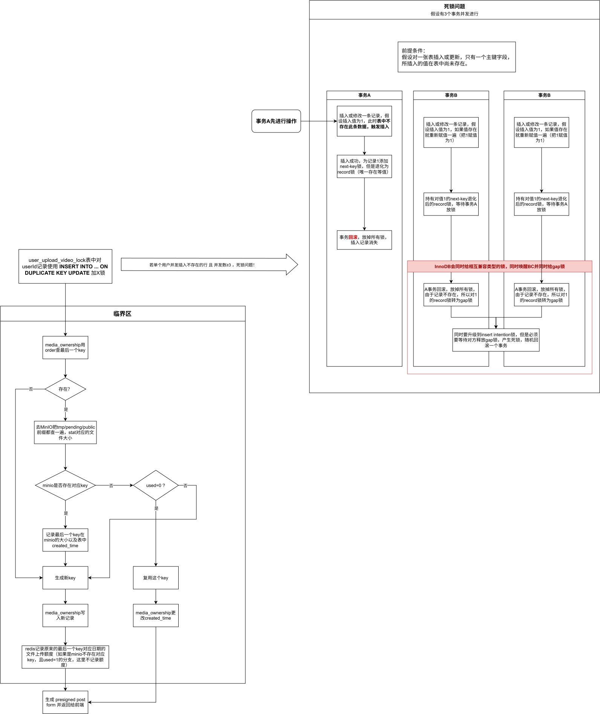
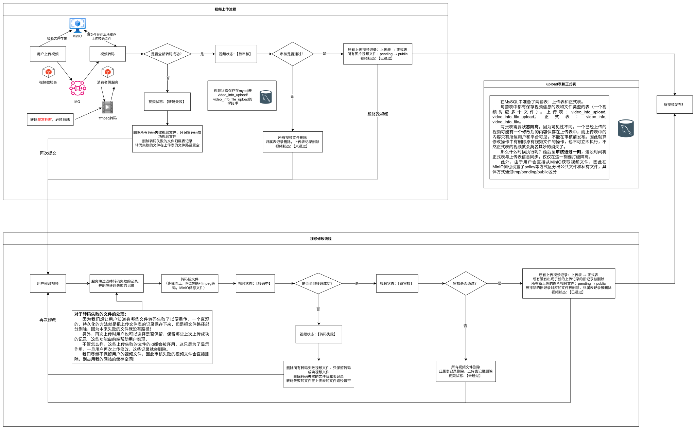

# Nilo技术亮点

- (下方图片为svg格式矢量图，建议下载后在浏览器中打开)
- 用户界面浏览移步至 ☞ 前端仓库：https://github.com/avaNeon/nilo-webpage/tree/main

## 1. 整体架构

<ul>
  <li>nilo-common：保存公共Java类、提供可选自动装配Bean、传递公共依赖、保存常量；非启动类，仅作为依赖使用</li>
  <li>nilo-web：主类，提供绝大多数业务接口</li>
  <li>nilo-mq-consumer：监听RabbitMQ的消费者，处理所有消费者逻辑</li>
  <li>nilo-admin：提供后台管理接口</li>
  <li>nilo-storage：存储微服务，提供与MinIO交互的存储功能相关的接口，接口全部用于内微服务调用</li>
  <li>nilo-comment：评论微服务，只负责评论相关逻辑；评论业务拆出，评论相关表分库，保证评论业务异常不影响核心功能，降低故障打击面。添加未迁移的关联表的冗余复制，利用分布式事务更改保证强一致</li>
  <li>nilo-canal-client：基于canal读取mysql的binlog，从而自动同步写入Elasticsearch，这里保留了从binlog到es的转化逻辑</li>
</ul>

## 2. InnoDB 死锁分析

定位并分析单用户并发上传场景下的InnoDB 死锁：多个事务执行INSERT ... ON DUPLICATE KEY UPDATE，且目标行不存在时，如果先插入的事务回滚了，会同时唤醒其它事务，并将他们的record 锁转为gap 锁（唯一索引），彼此持有兼容gap 锁后升级insert intention 锁形成死锁(并发数≥3 触发)。

<a href="nilo-web/src/main/java/com/neon/niloweb/mapper/UserUploadVideoLockMapper.java">10行：tryLock</a> -> <a href="nilo-web/src/main/resources/mapper/UserUploadVideoLockMapper.xml">129行：tryLock</a>

## 3. 上传文件日额度限制

文件上传基于MinIO presigned POST 实现前端直传，服务端不经手文件流无法直接限额；以 文件归属表 + Redis + MinIO presigned post form 上传大小限制，实现日配额严格限制。对已签发但未实际上传的 key 做复用，避免重复申请签名空耗配额。

<a href="nilo-web/src/main/java/com/neon/niloweb/controller/FileController.java">对外暴露接口，81行：uploadVideo</a> -> <a href="nilo-web/src/main/java/com/neon/niloweb/service/FileService.java">具体处理逻辑，190行：uploadVideo</a> ->（中间进入临界区） <a href="nilo-web/src/main/java/com/neon/niloweb/service/UploadService.java">临界区，51：getUploadKey</a> ->（返回继续执行uploadVideo） <a href="nilo-web/src/main/java/com/neon/niloweb/service/FileService.java">剩余处理逻辑，190行：uploadVideo</a>

【2、3共用一图】

  

## 4. 视频上传链路

视频上传/审核/发布状态机：上传/转码/审核状态通过 MySQL 字段持久化，阶段完成后写入状态并可供用户查看； MySQL 上传表与正式表状态隔离，保证修改后的视频未审核通过期间正式表内容公开并保持不变，仅在审核通过的同步点统一迁移更改到正式表；文件在 MinIO 保存，按 tmp/pending/public 三段前缀分区并配置 MinIO policy 区分公私读取权限，保证审核通过视频才可公开读取；转码经 MQ 解耦至独立消费微服务（FFmpeg），部分失败时保留成功文件、置空失败路径以支持用户增量重传。

<a href="nilo-web/src/main/java/com/neon/niloweb/controller/FileController.java">上传文件接口，81行：uploadVideo</a>（具体处理见3） -> <a href="nilo-web/src/main/java/com/neon/niloweb/controller/CreativeCenterController.java">上传/修改视频接口，57行：videoUpload</a> -> <a href="nilo-web/src/main/java/com/neon/niloweb/service/CreativeCenterService.java">具体处理逻辑，111行：videoUpload</a> -> <a href="nilo-mq-consumer/src/main/java/com/neon/nilomqconsumer/consumer/VideoTransCodingConsumer.java">转码视频文件，58行：receiveMessage</a> -> <a href="nilo-admin/src/main/java/com/neon/niloadmin/controller/VideoController.java">审核视频接口，76行：reviewVideo</a> -> <a href="nilo-admin/src/main/java/com/neon/niloadmin/service/VideoService.java">具体审核逻辑，150行：reviewVideo</a> -> <a href="nilo-admin/src/main/java/com/neon/niloadmin/service/UserMessageService.java">发送异步消息通知用户，34行：sendVideoReviewMessage</a>

  

## 5. 播放量记录统计链路

记录链路：接口仅 offer 入队无锁队列即返回，定时任务每 5s 聚合为 <视频ID, 增量> 并分批投递 MQ，记录与统计经 MQ 解耦；本机全组件本地部署，本机部署的 wrk 压测下入口接口可达 32.5k QPS ， MQ 无堆积。

统计链路：消费端并发消费，并行双写 MySQL/Redis ， DB 写入完成后再 ACK 以削峰。 MySQL 使用 批量小部分数据循环 + CASE … WHEN … 语法使错误范围与 RTT 损耗折中。 Redis 使用 Lua 脚本循环写入以减少 RTT ，内部使用 pcall 避免单条数据操作失败拖垮整组。

记录链路：<a href="nilo-web/src/main/java/com/neon/niloweb/controller/VideoController.java">107行：playCount</a> -> <a href="nilo-web/src/main/java/com/neon/niloweb/service/VideoService.java">244行：playCount</a> -> <a href="nilo-web/src/main/java/com/neon/niloweb/service/VideoService.java">402行：sendPlayCount</a>

统计链路：<a href="nilo-mq-consumer/src/main/java/com/neon/nilomqconsumer/consumer/PlayCountConsumer.java">consumer</a> -> <a href="nilo-mq-consumer/src/main/java/com/neon/nilomqconsumer/service/PlayCountService.java">service</a> -> <a href="nilo-mq-consumer/src/main/java/com/neon/nilomqconsumer/service/async/PlayCountAsyncService.java">flushPlayCountBatchToMysql和flushPlayCountBatchToRedis并行双写DB</a>

  

## 6. Redis 实现24 小时热度视频排行榜

储存结构优化：将单个视频统计结构从 “ 1 个播放记录 1 个 key ” 重构为按照小时桶保存当小时播放量，降低并固定单个视频热度存储占用， 1K 视频平均 100K 播放量的储存开销从 1GB 左右降低至固定 250KB 左右。全站视频热度总排行榜使用 ZSET 维护，固定时间聚合各个视频小时桶记录。

24 小时热度记录冷热分离：冷表只统计 1 小时播放记录，热表统计 24 小时播放记录，储存占用再降低 10 倍。设置固定升级/降级阈值，阈值之间设计迟滞区间避免记录抖动。冷热迁移步骤拆分 4 步保证自愈。

<a href="nilo-web/src/main/java/com/neon/niloweb/task/HotVideoTask.java">冷表刷新接口，16行：refreshColdCount；热表刷新接口，25行：refreshHotCount</a> -> <a href="nilo-web/src/main/java/com/neon/niloweb/repository/redis/HotVideoRedisRepository.java">冷表处理逻辑，48行：refreshColdCount；热表处理逻辑，200行：refreshHotCount</a>

  

## 7. MySQL 树形评论加载优化

前端参考 Reddit 评论区设计出树型评论，针对多层评论树加载（顶层 10 条 + 第一层 10 × 10 条）的 N+1 问题,先以 ROW_NUMBER() OVER (PARTITION BY parent_comment_id) 将每层查询收敛为单条 SQL ，再改用 JOIN LATERAL 将 LIMIT 下推至子查询内部，配合索引使每个父评论仅需一次索引 range 扫描；实测 EXPLAIN 中 filtered 由约 30% 提升至 100% ， SQL 执行次数由随树深度指数增长降至与深度同阶。

  

