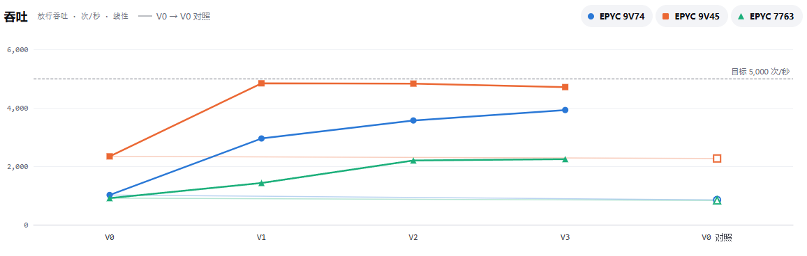
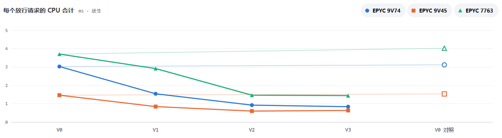
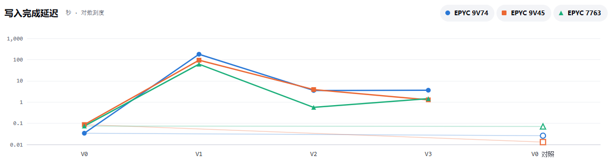

# 播放统计各版本对比

本文对比播放统计链路四个版本的压测结果，并分析每一项改动带来的变化。测试方法见 [压测方法](method.md)
，链路设计见 [播放量记录统计链路](../../source/play-count.md)。

交互式结果页面：<https://avaneon.github.io/nilo-server/test/perf-playCount/>，可按运行切换，查看每一轮的全部指标。

## 版本

各版本的请求都先经过会话与 IP 两个维度的限流检查（一次 Redis 脚本调用），区别在于放行之后如何写入。

| 版本 | 标签                                                           | 写入方式                                                                                                                                                  |
|------|----------------------------------------------------------------|-----------------------------------------------------------------------------------------------------------------------------------------------------------|
| V0   | [perf-v0](https://github.com/avaNeon/nilo-server/tree/perf-v0) | 请求线程内依次写 MySQL 与 Redis                                                                                                                           |
| V1   | [perf-v1](https://github.com/avaNeon/nilo-server/tree/perf-v1) | 请求只放入本地队列；每 5 秒按视频聚合为（视频，增量），每条消息最多 2,000 个视频，经 MQ 异步写入。消费端单线程，逐个视频执行一条 UPDATE 和一次 Redis 调用 |
| V2   | [perf-v2](https://github.com/avaNeon/nilo-server/tree/perf-v2) | 消费端批量写入：MySQL 每 100 个视频合并为一条 UPDATE（`CASE … WHEN`），Redis 用一次 Lua 脚本写完整条消息                                                  |
| V3   | [perf-v3](https://github.com/avaNeon/nilo-server/tree/perf-v3) | 消费端并行写入 MySQL 与 Redis，即当前线上版本                                                                                                             |

## 测试条件

每秒 5000 次、压测 3 分钟、热点分布；预热每秒 1000 次、30 秒；种子视频 10 万个；nilo-web 最大堆 256 MB；nginx 到 nilo-web 的并发上限
256。每次运行依次测试 V0、V1、V2、V3，最后重测 V0 作对照。

共运行三次，分到的硬件各不相同，两台机器均为 4 个 vCPU：

| 运行                                                                           | 被测机 CPU    | 压测机 CPU    | 往返时间 |
|--------------------------------------------------------------------------------|---------------|---------------|----------|
| [37568843535](https://github.com/avaNeon/nilo-server/actions/runs/37568843535) | AMD EPYC 9V74 | AMD EPYC 9V45 | 25 ms    |
| [37573243076](https://github.com/avaNeon/nilo-server/actions/runs/37573243076) | AMD EPYC 9V45 | AMD EPYC 7763 | 23 ms    |
| [37573210793](https://github.com/avaNeon/nilo-server/actions/runs/37573210793) | AMD EPYC 7763 | AMD EPYC 9V74 | 6 ms     |

## 结果

### 关键数字

以下为三次运行的范围：

| 指标                 | 结果                    | 对照轮与第 1 轮的差距 |
|----------------------|-------------------------|-----------------------|
| 每个放行请求的 CPU   | V3 比 V0 少 57%～72%    | ≤ 8.7%                |
| 放行吞吐             | V3 是 V0 的 2.0～3.9 倍 | ≤ 16.5%               |
| MySQL 每秒查询数峰值 | V2 为 V1 的 1/41～1/59  | —                     |
| 写入完成延迟（最长） | V1 179 秒，V2 3.9 秒    | —                     |

### 各轮数据

| 运行 | 版本       | 放行吞吐（次/秒） | 失败占比 | 每请求 CPU（ms） | 服务端平均响应（ms） | 写入完成延迟（秒） | MySQL 每秒查询数峰值 | 队列未确认峰值 | 被测机 CPU |
|------|------------|------------------:|---------:|-----------------:|---------------------:|-------------------:|---------------------:|---------------:|-----------:|
| 9V74 | V0         |             1,016 |    79.6% |             3.02 |                  174 |               0.03 |                2,886 |              0 |      89.8% |
| 9V74 | V1         |             2,951 |    40.8% |             1.54 |                 24.6 |                179 |                1,575 |             63 |      96.1% |
| 9V74 | V2         |             3,567 |    28.5% |             0.92 |                 20.1 |                3.5 |                   38 |              0 |      97.3% |
| 9V74 | V3         |             3,925 |    21.4% |             0.83 |                 18.0 |                3.6 |                   43 |              3 |      96.4% |
| 9V74 | V0（对照） |               848 |    83.0% |             3.12 |                  208 |               0.03 |                2,368 |              0 |      80.8% |
| 9V45 | V0         |             2,338 |    53.2% |             1.46 |                 72.9 |               0.09 |                5,206 |              0 |      97.3% |
| 9V45 | V1         |             4,839 |     3.2% |             0.84 |                  5.5 |                 94 |                2,462 |             56 |      92.5% |
| 9V45 | V2         |             4,829 |     3.4% |             0.60 |                  5.5 |                3.9 |                   42 |              0 |      84.1% |
| 9V45 | V3         |             4,710 |     5.8% |             0.63 |                  7.3 |                1.3 |                   41 |              0 |      86.8% |
| 9V45 | V0（对照） |             2,266 |    54.6% |             1.53 |                 76.8 |               0.01 |                5,000 |              0 |      96.5% |
| 7763 | V0         |               909 |    81.5% |             3.70 |                  143 |               0.07 |                2,280 |              0 |      99.7% |
| 7763 | V1         |             1,427 |    71.1% |             2.91 |                 38.9 |                 61 |                1,619 |             32 |      99.6% |
| 7763 | V2         |             2,198 |    55.9% |             1.46 |                 32.4 |               0.56 |                   33 |              2 |      98.9% |
| 7763 | V3         |             2,243 |    55.0% |             1.44 |                 33.3 |                1.4 |                   36 |              0 |      99.0% |
| 7763 | V0（对照） |               830 |    83.2% |             4.02 |                  164 |               0.07 |                2,200 |              0 |      99.5% |

失败均为 nginx 返回的 502：同时转发给 nilo-web 的请求达到上限后，超出的请求被立即拒绝。

  

  

  

## 分析

### 请求入口：从同步写库到本地聚合

V0 在请求线程内同步写 MySQL，而 nilo-web 的数据库连接池只有 10 个连接。压测中 Tomcat 的 200 个工作线程全部处于忙碌状态，其中
176～189 个线程在排队等待连接，平均等待 49～129 ms，而每次占用连接只有 3.3～8.4 ms。连接池因此成为 V0 的吞吐瓶颈：等待连接占服务端平均响应时间的
50%～74%，超出 nginx 并发上限的请求被直接拒绝，占总请求数的 53%～82%。

V1 起，请求线程只执行限流检查并将播放记录放入本地队列，不再访问 MySQL。吞吐不再受连接池限制，V1 的放行吞吐是 V0 的 1.6～2.9
倍，服务端平均响应时间由 73～174 ms 降至 5.5～39 ms。

### CPU 开销：请求路径与批量写入

V3 每个放行请求的 CPU 比 V0 少 57%～72%，降幅来自两步：

- **V0 → V1（少 21%～49%）**：请求线程不再为每个请求执行一次 JDBC 与 Redis 写入，nilo-web 自身的开销下降 41%～58%。此后
  nilo-web 的代码没有再改动。
- **V1 → V2（再少 29%～50%）**：消费端批量写入后，MySQL 的开销下降 61%～68%，Canal 与 ES 下降 69%～78%，MQ（RabbitMQ 与消费端）下降
  51%～66%。

MySQL 与 Canal/ES 是降幅最大的两项：二者合计占 V0 开销的 46%～49%，V3 降至 18%～26%，贡献了总降幅的 57%～72%。它们的开销与写入事务数相关：V0
每个放行请求对应一次独立的 UPDATE，产生一个 binlog 事务，由 Canal 逐个解析并同步到 ES；V1 把同一视频 5 秒内的多次播放合并为一次增量；V2
再把 100 个视频合并为一条 UPDATE，语句数与事务数大幅减少。

转发（宿主机上的 nginx 与 docker 端口转发）与写入方式无关，约占 V3 开销的 21%～23%。

需要说明，V0 有 53%～82% 的请求被 nginx 拒绝，处理这些请求消耗的 CPU 同样计入总量，V0 的每请求开销因此偏高，上述降幅包含这一因素。

### 消费端：积压与写入完成延迟

V1 的消费端为单线程，对每个视频分别执行一次 MySQL UPDATE 和一次 Redis 调用，处理一条消息（最多 2,000 个视频）需要数千次数据库与
Redis 往返，处理速度低于消息的到达速度。积压在压测期间持续累积：未确认消息的峰值为 32～63
条（消息已被预取到消费端，所以积压体现为"未确认"而非"待投递"），压测结束后还要 61～179 秒才能写完。

V2 把一条消息的处理缩减为约 20 条 SQL 与 1 次 Redis 脚本调用。消费端每个视频占用数据库连接的时间，由 V1 的 0.30～1.4 ms
降至折合 0.05～0.16 ms，V1 是 V2 的 5.6～9.4 倍。消费速度超过到达速度后，积压基本消失（最多 3 条）。

V2 起，写入完成延迟由本地队列的发送周期决定：播放记录每 5 秒发送一次，最后一批最多等待一个周期。V2、V3 的观测值为 0.56～3.9
秒，均未超过该周期。V1 的延迟是 V2 的 24～108 倍。

### MySQL 语句数

V2 的 MySQL 每秒查询数峰值为 33～42 次，是 V1（1,575～2,462 次）的 1/41～1/59，其中还包含写入监控自身每秒约 10
次的查询。同期每秒更新行数的峰值基本不变（V1 779～1,223 行，V2 716～1,175 行），说明节省的是每条语句与每次事务提交的固定开销（网络往返、语句解析、事务提交与
binlog 写入），而不是写入的数据量。

V0 的峰值为 2,280～5,206 次，只是 V1 的 1.4～2.1 倍。V1 的峰值反映的是单线程消费端持续满负荷时的处理速度，而不是聚合后实际需要写入的量，因此相对
V0 降幅有限。

### V3：并行写入没有稳定收益

V2 → V3 的变化：放行吞吐 −2.5%～+10.0%，每请求 CPU −9.3%～+5.5%，写入完成延迟有升有降，均处于对照轮的误差范围内。

原因在于 V2 之后消费端已不是瓶颈：一条消息的处理只有约 20 条 SQL 与 1 次 Redis 脚本调用，耗时远小于 5 秒的发送周期。V3 把
MySQL 与 Redis 的写入由串行改为并行，工作量不变，只缩短了每条消息的处理时间，对吞吐、CPU 与写入完成延迟都没有可测的影响。在当前负载下，V3
相对 V2 没有可测的收益。

### 吞吐与被测机 CPU

被测机的整机 CPU 说明了各次运行的瓶颈所在：

- **EPYC 7763**：各版本的 CPU 均在 99% 左右，始终饱和，吞吐取决于每个请求的 CPU 开销。V3 与 V0 的吞吐比（2.5 倍）与每请求 CPU
  之比（2.6 倍）基本一致。
- **EPYC 9V74**：V1～V3 的 CPU 均在 96% 以上，消费端、MySQL 与 Canal/ES 与 nilo-web 争用同一组 CPU，它们的开销下降直接转化为更高的吞吐。V0
  的 CPU 只有 90%，吞吐却最低，因为瓶颈在连接池，排队等待连接的线程不消耗 CPU。
- **EPYC 9V45**：V1～V3 的放行吞吐已达目标速率的 94% 以上，CPU 为 84%～93%，吞吐受目标速率限制，这几个版本之间的吞吐差异不反映处理能力。

CPU 饱和时，超出处理能力的请求在 nginx 的并发上限处被拒绝，所以前两台机器上 V1～V3 仍有 21%～71% 的请求失败；放行吞吐即该版本在这台机器上的处理上限。

### 误差

三次运行中，对照轮的放行吞吐都比第 1 轮低（−16.5%～−3.1%），每请求 CPU 都比第 1 轮高（+3.0%～+8.7%）。V0 → V1 的提升（1.6～2.9 倍）与
V3 相对 V0 的提升（2.0～3.9 倍）都明显大于这一差距，结论可靠；V2 → V3 的变化处于差距之内，不能据此判断二者的优劣。

对照轮的方向一致，提示误差中除随机波动外可能还存在与轮次顺序相关的系统性成分，原因尚待排查。

## 上限

待补充。

## 结论

- 把写库移出请求线程（V1）消除了连接池瓶颈，放行吞吐提升 1.6～2.9 倍，服务端平均响应时间由 73～174 ms 降至 5.5～39 ms。
- 消费端批量写入（V2）使 MySQL 语句数降至 V1 的 1/41～1/59，消除了 V1 的消费积压，写入完成延迟降至 5 秒的发送周期以内；MySQL 与
  Canal/ES 的开销随之大幅下降。
- 两步合计，每个放行请求的 CPU 减少 57%～72%。
- 消费端并行写入（V3）在当前负载下没有可测的收益。

## 局限

除 [压测方法](method.md) 中「可信度与局限」一节列出的共性局限外：

- 本次只测试了热点分布；均匀分布下同一视频在 5 秒内重复出现的概率更低，聚合的效果更小。
- 三次运行分到的硬件各不相同，各次运行之间只比较趋势。
- 在当前负载下消费端不是瓶颈，V2 与 V3 无法区分；要比较二者，需要让消费端成为瓶颈的负载。
