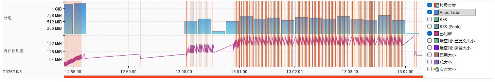
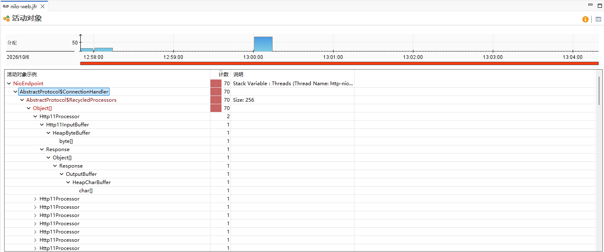
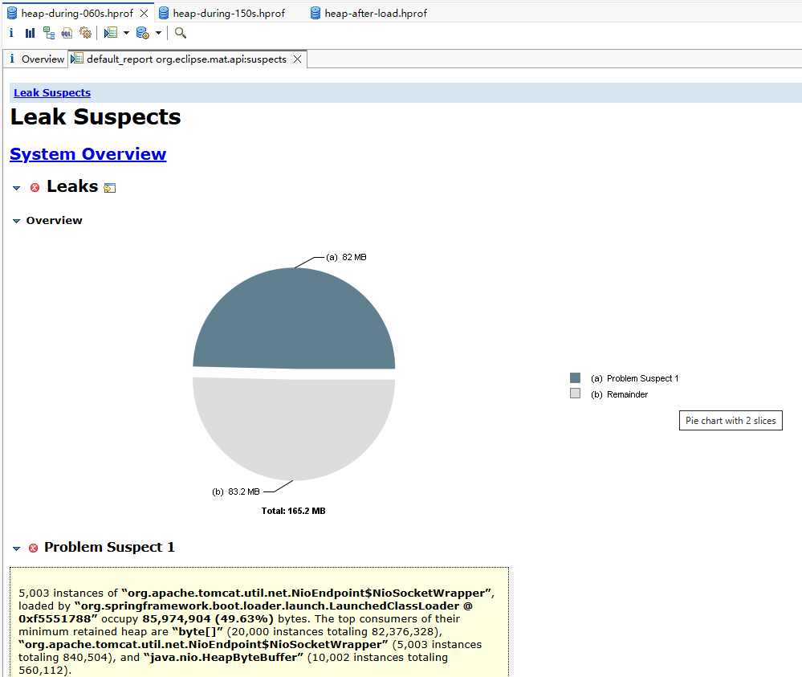
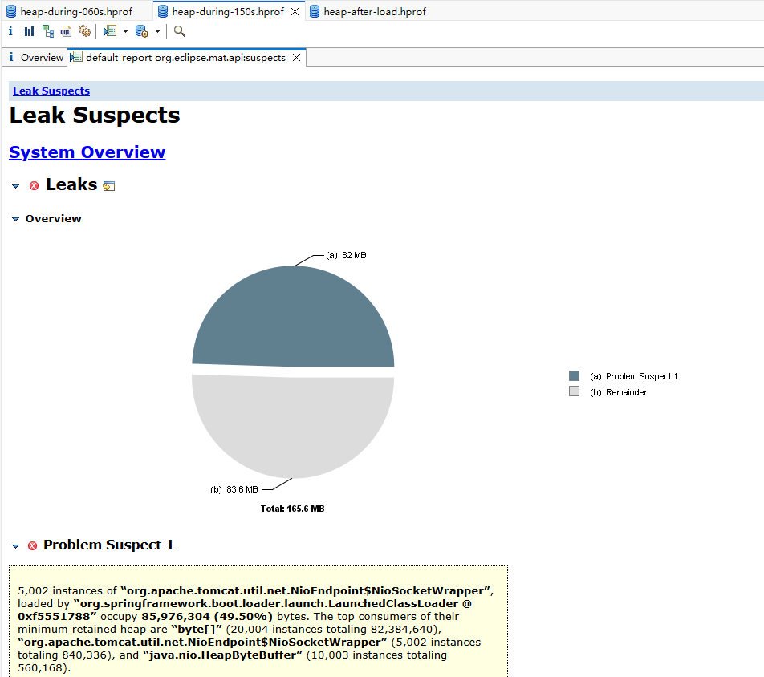

# 压测环境引入 nginx

压测环境最初没有 nginx：当时认为 nginx 只负责反向代理和传递客户端的真实 IP，与播放统计链路的性能无关，k6 直接访问
nilo-web。压测中 nilo-web 频繁发生全量 GC，经堆快照定位，原因是 Tomcat 为每条客户端连接分配的读写缓冲占满了老年代。本文记录这一问题的定位过程，以及引入
nginx 之后的两次调整。

nginx 的配置与参数说明见 [对外访问](../../deploy/nginx.md) 中的「到微服务的连接复用」一节，本文不再重复。

## 背景

nilo-web 的 JVM 与容器配置与线上一致（截止2026/10/07，以下为目前使用的配置）：

| 项目              | 值                    |
|-------------------|-----------------------|
| 初始堆  / 最大堆  | 128 MB / 256 MB       |
| 垃圾收集器        | SerialGC              |
| 老年代上限        | 170.7 MiB（堆的 2/3） |
| 容器内存上限      | 512 MB                |
| Tomcat 工作线程数 | 200（默认值）         |

SerialGC 的全量 GC 会暂停所有线程，停顿期间 nilo-web 不处理任何请求。

## 现象

V3、每秒 5000 次、热点分布，k6 直接连接
nilo-web（运行 [37329460210](https://github.com/avaNeon/nilo-server/actions/runs/37329460210)）：

| 指标                          | 值                       |
|-------------------------------|--------------------------|
| nilo-web 全量 GC              | 140 次，累计停顿 32.0 秒 |
| 老年代存活对象峰值 / 上限     | 170.7 / 170.7 MiB        |
| Tomcat 连接数峰值             | 5,003                    |
| Tomcat 忙碌线程峰值 / 上限    | 200 / 200                |
| 服务端响应时间 平均 / P99     | 16.5 ms / 297 ms         |
| 未能按时发出的请求（dropped） | 57,582（占 6.4%）        |

老年代被存活对象占满，每次全量 GC 都腾不出空间，于是全量 GC 接连发生。停顿期间请求不断积压，k6 为此启用更多 VU，每个 VU
建立一条新连接，连接数随之升到 VU 的上限。连接越多，堆里存活的对象越多，全量 GC 越频繁，形成循环。

报告中的指标只能说明老年代被占满，不能说明被什么占满。

## 定位

为此，压测工作流增加了诊断模式（[6b7dd12](https://github.com/avaNeon/nilo-server/commit/6b7dd12)）：

- nilo-web 全程 JFR 录制，并记录老年代抽样对象到 GC 根的引用路径；
- 压测开始后第 60 秒、第 150 秒及压测结束后，各拍一张堆快照。快照由 Spring Boot 的 heapdump 端点生成，生成前先做一次全量
  GC，快照中只剩存活对象。

第一次诊断时，快照文件写入容器，使容器超出 512 MB 的内存上限，nilo-web 被系统终止。此后工作流可以单独指定 nilo-web
的容器内存上限（[d57b159](https://github.com/avaNeon/nilo-server/commit/d57b159)），诊断运行把它放宽到 1 GB，最大堆保持 256
MB，堆与 GC 的行为不变。

诊断运行 [37416006984](https://github.com/avaNeon/nilo-server/actions/runs/37416006984)（V3、每秒 5000 次、热点分布）的
JFR 录制显示，压测开始后 GC 接连发生，已用堆始终在高位波动：

    
    
使用 JDK Mission Control 查看的图像，图中竖线即为 GC 暂停时间段

JFR 的老年代对象抽样给出了这些长期存活对象的持有者：70 个抽样对象经 Tomcat 的 `NioEndpoint` 引用而存活。`NioEndpoint`
是 Tomcat 管理网络连接的组件，所有连接以及缓存复用的请求处理器都由它持有。

    
    
使用 JDK Mission Control 查看的活动对象，抽样对象到 GC 根的路径起于 NioEndpoint

抽样只反映对象的分布，不能给出占用的总量。三张堆快照用 Eclipse Memory Analyzer（MAT）分析：

|                                       | 压测中（第 60 秒）  | 压测中（第 150 秒） | 压测后    |
|---------------------------------------|---------------------|---------------------|-----------|
| 存活对象合计                          | 165.2 MiB           | 165.6 MiB           | 79 MiB    |
| Tomcat 连接对象（`NioSocketWrapper`） | 5,003 个            | 5,002 个            | 2 个      |
| 连接对象保留的内存（占存活对象）      | 82.0 MiB（49.6%）   | 82.0 MiB（49.5%）   | 可忽略    |
| 其中的读写缓冲（`byte[]`）            | 20,000 个，78.6 MiB | 20,004 个，78.6 MiB | —         |
| Tomcat 请求与响应对象（各 200 个）    | 约 10 MiB           | 约 10 MiB           | 约 10 MiB |

    

        
        
使用 Eclipse MemoryAnalyzer 分析的结果，图中为压测第60s的堆情况

    

    

        
        
使用 Eclipse MemoryAnalyzer 分析的结果，图中为压测第150s的堆情况

    

由此得出：

- **压测带来的占用几乎全是连接对象。** MAT 的 Leak Suspects 只报告了一个问题对象：`NioEndpoint$NioSocketWrapper`，即每条连接一个的
  包装对象。5,003 个共保留 82.0 MiB，占存活对象的 49.6%，其中 78.6 MiB 是 `byte[]`，即 Tomcat 为每条连接分配的读、写缓冲（各
  8 KB），平均每条连接约 16 KB。连接不断开，缓冲就一直占用，空闲时也不释放。
- **压测结束后这部分占用随之消失。** 连接断开后，存活对象从约 165 MiB 降至 79 MiB，MAT 不再报告问题对象。
- **老年代因此接近占满。** 应用自身常驻约 80 MiB，加上连接对象的 82 MiB，合计约 165 MiB，接近 170.7 MiB 的老年代上限。
- **JFR 抽样与堆快照指向同一个持有者。** JFR 的抽样落在 `NioEndpoint` 缓存的请求处理器（`RecycledProcessors`）上，这部分只有约
  10 MiB，压测前后都存在，不是占用上涨的原因；堆快照统计全部存活对象，确认上涨的 82 MiB 来自同一个 `NioEndpoint` 持有的连接对象。

k6 的每个 VU 用一条长连接持续发送请求，相当于 5000 个一直在线、不停发请求的客户端，每个客户端都直接占用 Tomcat
的一组缓冲。线上用户的连接由 nginx 接住，nginx 再通过少量连接转发给 Tomcat，Tomcat 承受的连接数与用户数无关。压测环境缺少这一层，测到的是线上不存在的瓶颈。

## 修复一：由 nginx 接住客户端连接

[2843d00](https://github.com/avaNeon/nilo-server/commit/2843d00)：压测环境加入 nginx，k6 的请求先到 nginx，再经连接池（
`upstream` + `keepalive`）转发给 nilo-web，与线上的访问路径一致。Tomcat 的空闲超时与单条连接的请求数上限，与 nginx
的连接池参数相互配合。

线上的 nginx 此前虽然使用 HTTP/1.1 转发，但 `proxy_pass` 直接指向后端地址，没有配置连接池，连接实际上没有复用，本次一并修正。

引入 nginx 后的第一次运行（[37436858865](https://github.com/avaNeon/nilo-server/actions/runs/37436858865)）出现了新的问题：

| 指标              | 值                                                               |
|-------------------|------------------------------------------------------------------|
| 放行 / 失败       | 170,273 / 80,812                                                 |
| 失败原因          | nginx 连接 nilo-web 时报 `Address not available`，即本地端口耗尽 |
| Tomcat 连接数峰值 | 3,633                                                            |
| nilo-web 全量 GC  | 34 次                                                            |

原因有三点：

- **连接池过小。** `keepalive` 限制的是每个工作进程缓存的空闲连接数，当时为每进程 32 条，4 个进程合计 128 条。同时转发中的请求超过
  128 个时，nginx 为多出的请求新建连接，用完即关闭。
- **关闭的连接占用本地端口。** 主动关闭连接的一方要让本地端口在 TIME_WAIT 状态停留约 60 秒。可用的本地端口约 2.8
  万个，每秒新建超过约 470 条连接就会耗尽。本次压测开始约 25 秒后端口耗尽，此后转发持续失败。
- **nginx 运行在容器中。** 请求经 Docker 虚拟网络转发。Linux 默认只在回环地址上复用处于 TIME_WAIT 的端口；线上 nginx
  转发给本机回环地址，受这一机制保护，容器网络则不受保护。

此外，nilo-web 一旦变慢，积压的请求就会让 nginx 不断新开连接，Tomcat 的连接数仍升到 3,633，老年代再次接近占满。

## 修复二：nginx 移到宿主机，加大连接池

[9e50fbd](https://github.com/avaNeon/nilo-server/commit/9e50fbd)：

- nginx 与线上一样运行在宿主机上，转发给只在本机监听的 nilo-web；
- 连接池调整为每进程 256 条，覆盖高峰时同时转发中的请求数；
- 文件句柄上限调高到 65535。

## 修复三：限制到 nilo-web 的并发数

连接池只解决平时的连接复用，管不住卡顿时连接数的暴涨。nilo-web 停顿 1.5 秒，每秒 5000 次的请求会积压约 7500 个，nginx
会为它们新开约 7500 条连接，按每条 16 KB 计约 120 MB，足以再次占满老年代。

[e5bbb95](https://github.com/avaNeon/nilo-server/commit/e5bbb95)：`upstream` 增加共享内存区与 `max_conns`，同时转发给
nilo-web 的请求最多 256 个（参照 Tomcat 的 200 个工作线程留出余量），连接池不小于该上限。超出上限的请求由 nginx 立即返回
502，不进入 Tomcat。

代价是：卡顿期间超出上限的请求直接失败，不排队等待。对播放统计而言，过载时损失少量计数可以接受，换来的是 nilo-web
不会因连接涌入而陷入连续的全量 GC。

## 效果

两次运行均为 V3、每秒 5000 次、热点分布，被测机均为 EPYC 9V45：

| 指标                      | 修复前（[37329460210](https://github.com/avaNeon/nilo-server/actions/runs/37329460210)） | 修复后（[37448126418](https://github.com/avaNeon/nilo-server/actions/runs/37448126418)） |
|---------------------------|------------------------------------------------------------------------------------------|------------------------------------------------------------------------------------------|
| nilo-web 全量 GC          | 140 次，累计停顿 32.0 秒                                                                 | 0 次                                                                                     |
| 老年代存活对象峰值        | 170.7 MiB（占满）                                                                        | 91.6 MiB                                                                                 |
| Tomcat 连接数峰值         | 5,003                                                                                    | 433                                                                                      |
| Tomcat 忙碌线程峰值       | 200 / 200                                                                                | 41 / 200                                                                                 |
| 服务端响应时间 平均 / P99 | 16.5 ms / 297 ms                                                                         | 3.2 ms / 48.6 ms                                                                         |
| 放行请求                  | 842,419                                                                                  | 879,460                                                                                  |
| 未能完成的请求            | 未按时发出 57,582                                                                        | nginx 返回 502：20,541（占 2.3%）                                                        |

两次运行中两台机器之间的往返时间不同（41 ms 与 1 ms），表中的响应时间取 nilo-web 自身的统计，不含网络往返。

修复后，Tomcat 的连接数取决于 nginx
的连接池，不再随客户端数量增长；老年代存活对象回落到应用自身的常驻水平。此后的所有压测，包括 [播放统计各版本对比](eval.md)
的三次运行，都在这一环境下进行，各轮 nilo-web 均未发生全量 GC。

## 线上配置

线上 nginx 同步加入连接池与并发上限，参数与压测环境一致，见 [对外访问](../../deploy/nginx.md) 中的「到微服务的连接复用」一节。

## 小结

- **压测环境应与线上的访问路径一致。** 省掉 nginx 看似只省掉了反向代理，实际上改变了 Tomcat 承受的连接数，测出的是线上不存在的瓶颈。
- **指标说明"满了"，堆快照说明"被什么占满"。** JFR 的老年代对象抽样能指出存活对象的持有者，各部分占用多少要依靠堆快照统计。
- **连接池的大小要覆盖高峰时的并发，同时要给并发设上限。** 只有连接池时，后端一次卡顿就会引发连接涌入；只有上限而连接池过小，平时就会频繁新建、关闭连接。
