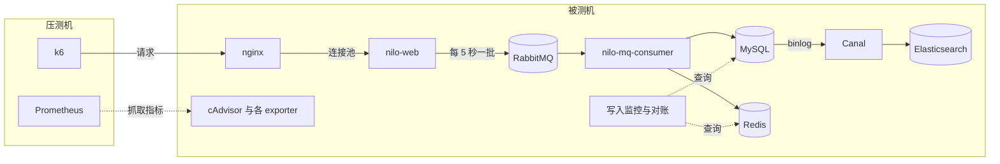
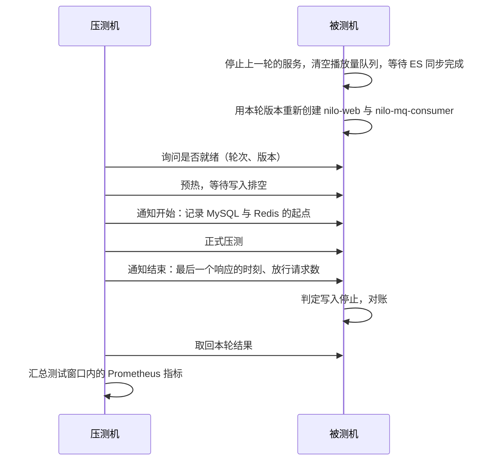

# 压测方法

本文说明播放统计链路的压测方法：测试环境、负载、一次运行的流程，以及各项指标的定义与采集方式。结果见 [播放统计各版本对比](eval.md)。

## 测试对象

测试覆盖播放统计接口及其后的整条写入链路：nilo-web 接收请求，经本地队列与 MQ 交给 nilo-mq-consumer，写入 MySQL 与 Redis，再由
Canal 将 MySQL 的变更同步到 Elasticsearch。链路上的中间件都是真实组件，每轮结束后逐条对账，因此这项测试既衡量性能，也验证写入的正确性。

测试只覆盖播放统计这一条链路，由 GitHub Actions 手动触发，不随代码推送运行。

## 测试环境

两台 GitHub Actions 托管的云主机（各 4 个 vCPU），经 Tailscale 隧道互联：

| 角色   | 运行的内容                                                                                                                                                                                |
|--------|-------------------------------------------------------------------------------------------------------------------------------------------------------------------------------------------|
| 被测机 | 中间件（MySQL、Redis、RabbitMQ、Elasticsearch、Canal、Nacos 等）与微服务（nilo-web、nilo-mq-consumer、nilo-canal-client），由 docker compose 启动；nginx 运行在宿主机；写入监控与对账脚本 |
| 压测机 | k6 发送请求；Prometheus 抓取被测机的指标                                                                                                                                                  |

图中为 V1 及以后版本的写入路径；V0 由 nilo-web 在请求线程内直接写入 MySQL 与 Redis。

- **与线上一致**：被测机上各组件的镜像版本、内存上限、JVM 参数，以及 MySQL、Redis 的配置均照抄线上；nginx 与线上一样运行在宿主机，经连接池转发给
  nilo-web，原因见 [压测环境引入 nginx](fix.md)。与线上的差异（测试账号、ES 扩展词典等）不在播放统计链路上。
- **访问限制**：被测机只对压测机开放压测入口和只读的指标端口，MySQL、Redis、Elasticsearch 只在被测机本机监听。
- **硬件**：每次运行分到的 CPU 型号与两台机器之间的网络都可能不同，报告中记录两台机器的 CPU 型号、核数与 Tailscale 往返时间。

## 负载

| 项目       | 设置                                                                                            |
|------------|-------------------------------------------------------------------------------------------------|
| 发送方式   | k6 固定到达率（constant-arrival-rate）：按设定的速率发出请求，不受响应快慢影响                  |
| 速率与时长 | 工作流输入，默认每秒 5000 次、3 分钟                                                            |
| 预热       | 正式压测前以每秒 1000 次预热 30 秒，待预热产生的写入排空后再记录起点                            |
| 种子数据   | 10 万个视频，ID 连续编号；播放量写入会更新这些视频                                              |
| 视频分布   | uniform：在全部视频中均匀选取；hot：80% 的请求落在 1% 的视频上                                  |
| 会话与 IP  | 每个请求带随机的 sessionId 与 `X-Real-IP`，会话与 IP 两个维度的限流都不会触发，请求均走放行路径 |

- 测试环境的 nginx 透传压测机发来的 `X-Real-IP`；线上取客户端的实际地址。
- k6 的每个 VU 用一条长连接持续发送请求。VU
  的数量最多等于每秒请求数，全部占用时，到点的请求无法发出，记为"未能按时发出"（dropped）。

## 一次运行的流程

一次运行在同一对机器上依次测试多个版本，每个版本一轮；版本不止一个时，最后再测一遍第一个版本作对照。不同运行分到的硬件可能不同，结果不宜直接比较；同一次运行内，各版本使用相同的机器与网络，比较才公平。对照轮与第一轮是同一个版本，二者的差距反映先后顺序与机器波动带来的影响。

每一轮的流程如下：

- 每一轮都重新创建 nilo-web 与 nilo-mq-consumer，包括第一轮和对照轮，各轮都从刚启动的服务开始。
- 中间件全程不重启，对账只计算本轮起点之后的增量，因此各轮之间不需要重新导入数据。

## 写入停止的判定与对账

**写入停止**：压测机通知压测结束后，被测机每 0.1 秒查询一次 MySQL 播放量的总和与 Redis 中 `HINCRBY`
的累计执行次数（该命令只出现在播放量写入脚本中），两者连续 10 秒不变即判定写入停止；停止时刻取第一次查到最终值的那次查询的结束时间。V1
及以后的版本每 5 秒才发送一批播放量，两批之间可能有近 5 秒没有写入，因此等待窗口必须长于 5 秒。

**写入完成延迟** = 写入停止时刻 − 压测机收到最后一个响应的时刻，即最后一批播放量在压测结束后多久才落库。V0 在请求线程内同步写入，该值接近
0。

**对账**：MySQL 播放量的增量、Redis 当日播放量的增量，都必须恰好等于放行请求数。排空最多等待 30 分钟，超时记为排空超时。

两台机器各自记录时钟同步状态，写入完成延迟涉及两台机器的时刻。

## 指标

测试窗口指从记录起点到判定写入停止的时段，包含压测结束后的排空阶段。

| 指标                       | 定义                                                                                                      | 来源                       |
|----------------------------|-----------------------------------------------------------------------------------------------------------|----------------------------|
| 放行 / 被限流 / 失败       | 接口返回成功、返回限流、其他结果的请求数；失败按原因区分：nginx 返回的 502、其他 5xx、4xx、连接失败或超时 | k6                         |
| 未能按时发出               | 到点时没有空闲 VU、未能发出的请求数                                                                       | k6                         |
| 放行吞吐                   | 放行请求数 ÷ 压测时长                                                                                     | k6                         |
| 放行请求的响应时间         | 只统计放行的请求，不受立即返回的 502 影响                                                                 | k6                         |
| 服务端响应时间             | nilo-web 统计的处理时间，不含网络往返与在 nginx 排队的时间                                                | nilo-web 的 HTTP 指标      |
| 每个放行请求的 CPU         | 测试窗口内各容器及宿主机上 nginx、dockerd 消耗的 CPU 时间 ÷ 放行请求数，按组件分别列出                    | cAdvisor                   |
| 被测机整机 CPU             | 每秒采样一次，包含容器之外的开销（Tailscale、内核收发网络包等），取压测期间的平均与 P95                   | 被测机上的采样脚本         |
| 写入完成延迟、对账         | 见上一节                                                                                                  | 被测机上的写入监控         |
| 队列积压峰值               | 播放量队列中待投递、未确认的消息数峰值                                                                    | RabbitMQ                   |
| MySQL 每秒更新行数、查询数 | 测试窗口内的峰值                                                                                          | mysqld-exporter            |
| Redis 每秒命令数           | 测试窗口内的峰值，另按命令统计每个放行请求的平均条数                                                      | redis-exporter             |
| 线程、连接池与 GC          | Tomcat 忙碌线程与连接数、数据库连接池的占用与等待、小 GC 与全量 GC 的次数和停顿、老年代存活对象           | nilo-web 等服务的 JVM 指标 |

压测机每秒记录一次自身的 CPU 使用率，用于判断瓶颈是否在压测机。

每次运行结束后，工作流把两台机器的结果合并成报告，写在该次运行的摘要页上，并上传原始数据（Prometheus 数据、日志、写入进度曲线等）。

## 诊断模式

工作流的诊断模式用于查看 nilo-web 的堆：

- nilo-web 全程 JFR 录制，并记录老年代抽样对象到 GC 根的引用路径；
- 每轮压测开始后第 60 秒、第 150 秒及压测结束后，各拍一张堆快照。

拍快照会让服务停顿，诊断运行的数字只用于分析堆，不与其他运行比较。使用实例见 [压测环境引入 nginx](fix.md)。

## 可信度与局限

可信度的保障：

- **对照轮**：估计同一次运行内的误差，版本之间小于该误差的差异不下结论；
- **对账**：每个放行请求都必须被写入，结果不以丢失数据为代价；
- **记录测试条件**：CPU 型号、核数、Tailscale 往返时间、压测机 CPU，均写入报告。

局限：

- 云主机的硬件每次可能不同，不同运行之间只比较趋势，不比较绝对值；
- 被测机只有 4 个 vCPU，所有组件共用，目前只能测量出单机部署（同目前线上部署，截止到2026/10/07）下的表现；
- 每种配置只运行一次，每次运行内各版本各测一轮；
- 只覆盖播放统计链路。

## 复现方式

- 工作流：[perf-play-count.yml](../../../../.github/workflows/perf-play-count.yml)，在仓库的 Actions
  页面手动触发。可设置的输入包括被测版本、速率、时长、预热、种子视频数、视频分布、nilo-web 的堆与容器内存、nginx 到 nilo-web
  的并发上限、诊断模式。使用前需在仓库中配置 Tailscale 的 OAuth client，说明见工作流文件开头的注释。
- 被测环境：[docker/integration](../../../../docker/integration)
  ；两台机器上的脚本：[docker/integration/perf](../../../../docker/integration/perf)。
- 结果页面的数据由 [report_to_json.py](../../../../docker/integration/perf/report_to_json.py) 从报告转换而来。
