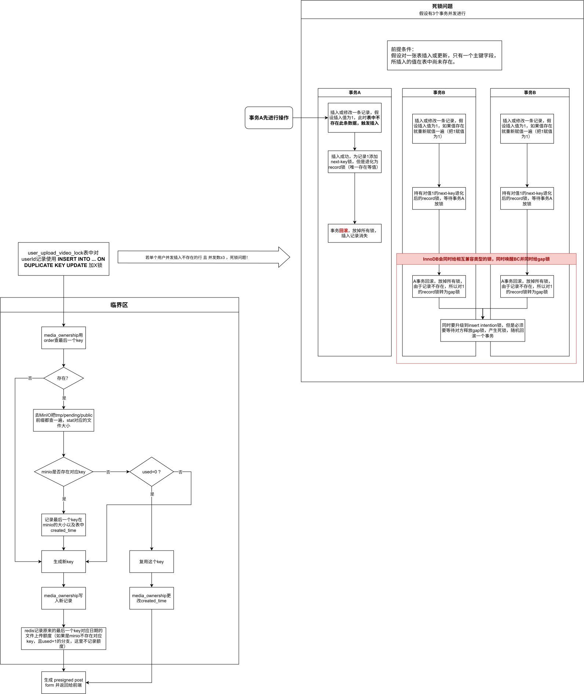

# 上传文件日额度限制

本文说明前端直传时如何限制每日上传额度，以及该设计在单用户并发上传时触发的 InnoDB 死锁。

## 日配额

文件上传基于MinIO presigned POST 实现前端直传，服务端不经手文件流无法直接限额；以 文件归属表 + Redis + MinIO presigned
post form 上传大小限制，实现日配额严格限制。对已签发但未实际上传的 key 做复用，避免重复申请签名空耗配额。

【见下图左侧部分】

对外暴露接口 <a href="../../../nilo-web/src/main/java/com/neon/niloweb/controller/FileController.java">
uploadVideo:81行</a> ->
具体处理逻辑 <a href="../../../nilo-web/src/main/java/com/neon/niloweb/service/FileService.java">
uploadVideo:190行</a> ->
（中间进入临界区）临界区 <a href="../../../nilo-web/src/main/java/com/neon/niloweb/service/UploadService.java">
getUploadKey:51</a> ->
（返回继续执行uploadVideo）剩余处理逻辑 <a href="../../../nilo-web/src/main/java/com/neon/niloweb/service/FileService.java">
uploadVideo:190行</a>

## InnoDB 死锁

定位并分析单用户并发上传场景下的InnoDB 死锁：多个事务执行INSERT ... ON DUPLICATE KEY
UPDATE，且目标行不存在时，如果先插入的事务回滚了，会同时唤醒其它事务，并将他们的record 锁转为gap 锁（唯一索引），彼此持有兼容gap
锁后升级insert intention 锁形成死锁 (并发数≥3 触发)。

【见下图右侧部分】

<a href="../../../nilo-web/src/main/java/com/neon/niloweb/mapper/UserUploadVideoLockMapper.java">
tryLock:10行</a> -> <a href="../../../nilo-web/src/main/resources/mapper/UserUploadVideoLockMapper.xml">
tryLock:129行</a>

  

