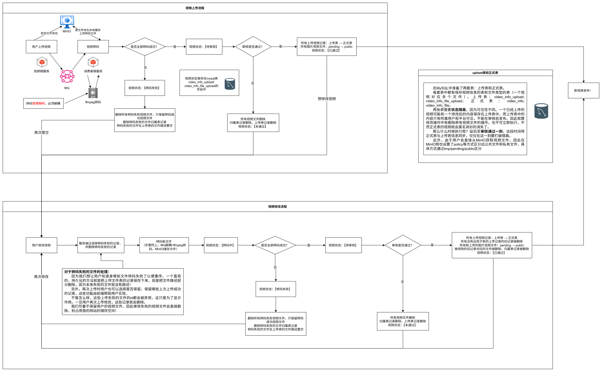

# 视频上传链路

本文说明视频上传、转码、审核与发布的链路。

视频上传/审核/发布状态机：上传/转码/审核状态通过 MySQL 字段持久化，阶段完成后写入状态并可供用户查看； MySQL 上传表与正式表状态隔离，保证修改后的视频未审核通过期间正式表内容公开并保持不变，仅在审核通过的同步点统一迁移更改到正式表；文件在 MinIO 保存，按 tmp/pending/public 三段前缀分区并配置 MinIO policy 区分公私读取权限，保证审核通过视频才可公开读取；转码经 MQ 解耦至独立消费微服务（FFmpeg），部分失败时保留成功文件、置空失败路径以支持用户增量重传。

<a href="../../../nilo-web/src/main/java/com/neon/niloweb/controller/FileController.java">上传文件接口，81行：uploadVideo</a>（具体处理见 [上传文件日额度限制](upload-quota.md)） -> <a href="../../../nilo-web/src/main/java/com/neon/niloweb/controller/CreativeCenterController.java">上传/修改视频接口，57行：videoUpload</a> -> <a href="../../../nilo-web/src/main/java/com/neon/niloweb/service/CreativeCenterService.java">具体处理逻辑，111行：videoUpload</a> -> <a href="../../../nilo-mq-consumer/src/main/java/com/neon/nilomqconsumer/consumer/VideoTransCodingConsumer.java">转码视频文件，58行：receiveMessage</a> -> <a href="../../../nilo-admin/src/main/java/com/neon/niloadmin/controller/VideoController.java">审核视频接口，76行：reviewVideo</a> -> <a href="../../../nilo-admin/src/main/java/com/neon/niloadmin/service/VideoService.java">具体审核逻辑，150行：reviewVideo</a> -> <a href="../../../nilo-admin/src/main/java/com/neon/niloadmin/service/UserMessageService.java">发送异步消息通知用户，34行：sendVideoReviewMessage</a>

  

